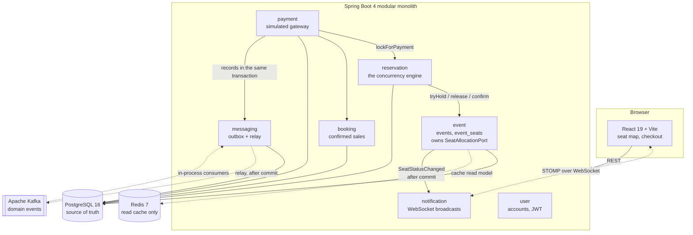
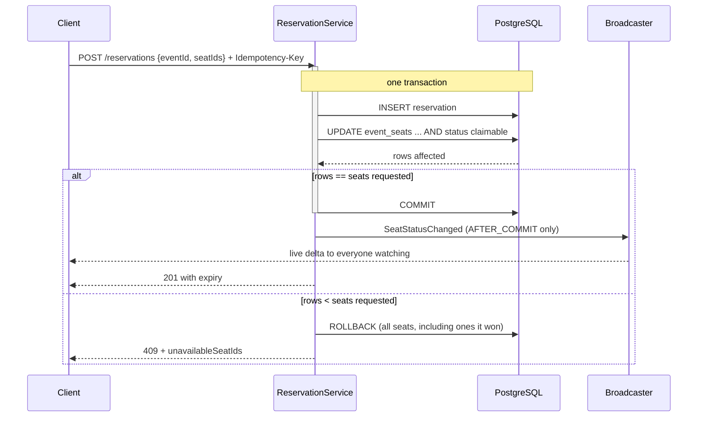
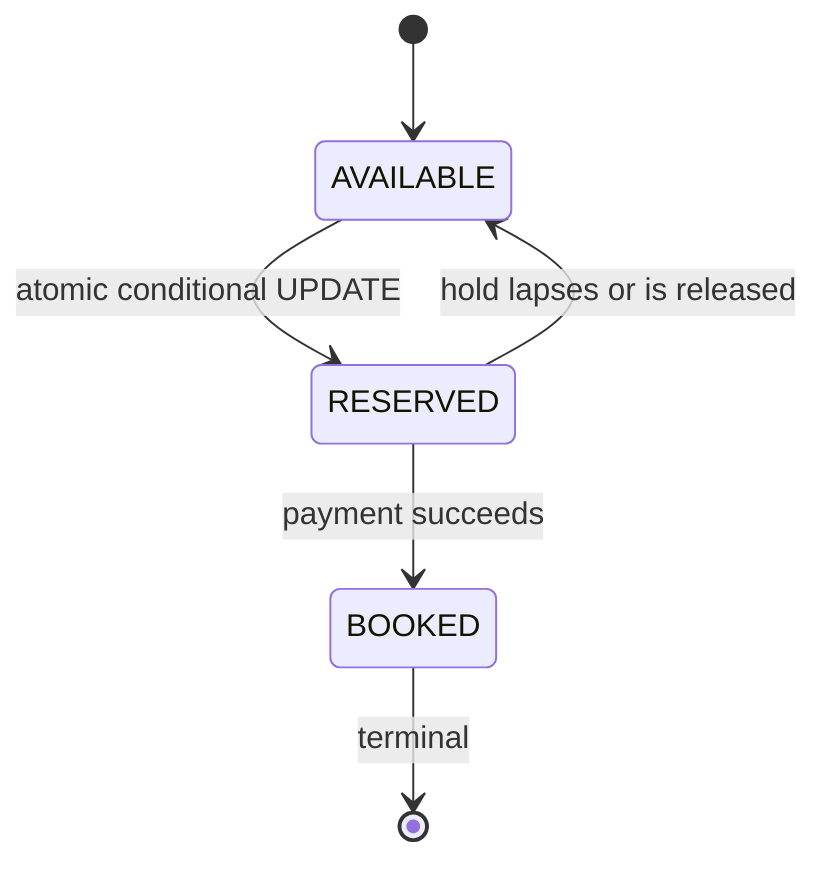

# SeatFlow

A high-concurrency event ticket reservation platform. Browse events, pick seats
from a map that updates live as other people take them, hold your seats against
a countdown, pay, and get a booking reference.

**Java 21 · Spring Boot 4 · PostgreSQL 16 · Redis 7 · Apache Kafka · React 19 · Docker**

---

## The problem this exists to solve

When 1,000 people reach for 100 seats at the same instant, exactly one person
gets each seat, and the database never ends up inconsistent.

That is the whole project. Redis, Kafka, WebSockets, and the rest make it a real
product, but they are deliberately kept **out of the correctness path** —
PostgreSQL alone decides who owns a seat. Both of those claims are tested by
turning the service off and running the full suite against it.

### The race

Check-then-act. Two requests for seat A12:

```
T1: SELECT status FROM event_seats WHERE id=A12   ->  AVAILABLE
T2: SELECT status FROM event_seats WHERE id=A12   ->  AVAILABLE
T1: UPDATE event_seats SET status='RESERVED' WHERE id=A12
T2: UPDATE event_seats SET status='RESERVED' WHERE id=A12
                          ^ both commit. Both clients think they won.
```

No isolation level fixes this as written — the second UPDATE has no predicate
that can fail. Raising the isolation level is not the answer; changing the shape
of the statement is.

### The fix

Collapse check and act into one statement and let the database arbitrate:

```sql
UPDATE event_seats
   SET status = 'RESERVED', held_by_reservation_id = :reservationId, held_until = :expiresAt
 WHERE event_id = :eventId
   AND id IN (:seatIds)
   AND ( status = 'AVAILABLE'
      OR (status = 'RESERVED' AND held_until < now()) );   -- lapsed holds are free
```

Under READ COMMITTED, a blocked UPDATE **re-evaluates its WHERE clause against
the newly committed row**. Because the clause requires the seat to still be
claimable, the loser matches zero rows. The affected-row count is the verdict:

```java
int claimed = seatAllocation.tryHold(eventId, seatIds, reservationId, expiresAt);
if (claimed != seatIds.size()) {
    throw new SeatsUnavailableException(eventId, seatIds);  // rolls back ALL of them
}
```

One transaction, so a partial hold is impossible — you get every seat you asked
for or none, which is what "A12 and A13 together" means to a person.

Underneath it all, one index makes overselling structurally impossible:

```sql
CREATE UNIQUE INDEX uq_booking_seat_once ON booking_seats (event_seat_id);
```

A `booking_seats` row exists only for a confirmed booking, so a seat can appear
in at most one booking ever. Every layer above can be broken and the database
still refuses.

Full argument, including failure modes: **[docs/CONCURRENCY.md](docs/CONCURRENCY.md)**.

---

## Proof, not claims

Every number here was measured. Commands are in [docs/VERIFY.md](docs/VERIFY.md).

| Test | Result |
| --- | --- |
| 200 threads reach for **one** seat | Exactly **1** winner, 199 clean conflicts |
| 200 threads across **10** seats | Exactly **10** held, none held twice |
| Two overlapping multi-seat requests | Exactly one wins, all-or-nothing |
| Lapsed hold, **sweeper disabled** | Reclaimable anyway |
| A seat forced into a second booking | Refused by the database |
| Full checkout suite with **Kafka stopped** | 22/22 pass, 4 bookings, 0 sold twice |
| Reservations with **Redis stopped** | Still 201, 4 held, 0 sold twice |
| Reservations with **Redis never reachable** | App starts and sells seats |
| **Two instances**, seat held on one | Both instances' clients notified, same `seq` |
| **Two instances**, one booking | Exactly one confirmation, on the other node |

**Load: 1,000 virtual users against 100 seats.** 75,868 requests at 1,018 req/s,
median 79 ms, p95 953 ms — and **exactly 100 seats sold**. The test fails itself
if the ledger is ever oversold.

Tripling the connection pool made throughput *33% worse*. The bottleneck was
never the pool; it is row-lock contention on 100 rows. Both runs and the
reasoning are in **[load/RESULTS.md](load/RESULTS.md)** — including the note that
these runs predate Kafka, so the throughput figure is not claimed against the
current commit.

Test suite: 3 unit + 27 integration tests against real PostgreSQL, Redis and
Kafka via Testcontainers. Plus 87 end-to-end API checks across four shell suites,
all passing against a two-instance containerised stack.

---

## Architecture

A modular monolith. Not microservices — splitting the booking transaction across
a network boundary would destroy the single-transaction guarantee the whole
design rests on.



`reservation` never touches another module's tables. It goes through
`SeatAllocationPort`, so every mutation of the contended row happens in one
auditable place.

### Reserving a seat



The broadcast fires **only after commit**. Publishing inside the transaction
would tell every watching browser a seat was gone that then rolled back.

### Seat lifecycle



A lapsed hold is treated as claimable by the hold query itself, so expiry
correctness never depends on the scheduled sweeper having run.

---

## Running it

Everything, from nothing:

```bash
cp .env.example .env    # then edit the two secrets
docker compose up --build
```

Then open **http://localhost:8088**.

Only the frontend port is published. nginx proxies `/api` and `/ws` to the
backend on the internal network, so the browser stays same-origin and CORS never
enters the picture. PostgreSQL and Redis are not reachable from outside.

For development with an IDE, start just the databases and run the two apps
directly:

```bash
docker compose -f infra/docker-compose.dev.yml up -d
cd backend  && ./mvnw spring-boot:run -Dspring-boot.run.profiles=local
cd frontend && npm run dev
```

Seed a realistic event — a 188-seat hall with holds and sales, all created
through the public API:

```bash
bash scripts/seed-demo.sh
```

---

## API

Interactive reference at **`/docs`** (OpenAPI 3 via springdoc).

| Method | Path | Notes |
| --- | --- | --- |
| `POST` | `/api/v1/auth/register` · `/login` · `/refresh` | JWT access + rotating refresh token |
| `GET` | `/api/v1/events` | Public catalogue |
| `GET` | `/api/v1/events/{id}/seats` | Seat map. Cached, live-updated |
| `POST` | `/api/v1/reservations` | Hold seats. `Idempotency-Key` honoured |
| `DELETE` | `/api/v1/reservations/{id}` | Release early |
| `POST` | `/api/v1/payments` | Pay for a hold, returns the booking |
| `GET` | `/api/v1/bookings` | Booking history |
| `POST` | `/api/v1/admin/venues` · `/admin/events` | Admin only |

Errors are RFC 9457 `application/problem+json` throughout. A seat conflict names
the seats you lost so the client can grey them out and keep the rest:

```json
{
  "type": "https://seatflow.dev/problems/seat-unavailable",
  "title": "Seat unavailable",
  "status": 409,
  "detail": "1 of 2 requested seats are no longer available.",
  "unavailableSeatIds": ["8e19a22b-..."]
}
```

---

## Observability

Actuator is **not proxied through nginx**, so `/actuator/*` is unreachable from
outside the compose network — a scraper or an operator reaches it on the internal
network, where everything except the health probes still requires the ADMIN role.
Logs are ECS JSON under the `docker` profile.

```bash
docker compose exec backend curl -s -H "Authorization: Bearer $ADMIN_TOKEN" \
  http://127.0.0.1:8080/actuator/prometheus | grep seatflow_
```

| Metric | What it tells you |
| --- | --- |
| `seatflow_reservation_requests_total` | Demand |
| `seatflow_reservation_conflicts_total` | How much of it is losing seat races |
| `seatflow_booking_success_total` | Payments that became bookings |
| `seatflow_booking_failures_total` | Money that did not turn into a seat |
| `seatflow_reservations_active` | Holds live right now |
| `seatflow_outbox_pending` | Domain events committed but not yet on Kafka |
| `seatflow_outbox_published_total` | Messages the broker acknowledged |
| `seatflow_outbox_failures_total` | Send attempts it did not |
| `seatflow_notifications_sent_total` | Confirmations dispatched by a consumer |
| `seatflow_revenue_cents_total` | Settled payment value, from the topic |

A high conflict rate is the system working, not failing. It only matters if it
stays high when demand is low.

`seatflow_outbox_pending` is the one worth an alert. It sits near zero and spikes
briefly under load; a value that climbs and stays up means the relay has stopped
draining, and neither counter can tell you that on its own — a stopped relay
increments neither.

---

## Domain events

Three topics, published through a **transactional outbox** so a booking and the
announcement of it share one commit:

| Topic | Emitted when | Consumed by |
| --- | --- | --- |
| `booking.confirmed` | a payment settles into a booking | confirmation dispatch |
| `payment.completed` | the same commit, separate fact | revenue analytics |
| `reservation.expired` | the sweeper marks a lapsed hold | inventory analytics |

The event is an `INSERT` into the `outbox` table inside the booking transaction;
a relay polls the table and publishes afterwards. Publishing to Kafka *inside*
the transaction is a dual write with no safe ordering — send first and a failed
commit announces a booking that never happened, commit first and a crash loses
the event silently.

```java
// PaymentLedger.settle(), inside the transaction
outbox.record(new BookingConfirmed(...));
outbox.record(new PaymentCompleted(...));
// COMMIT: booking, seats, payment and both messages, or none of them
```

The relay claims work with `FOR UPDATE SKIP LOCKED` and keeps no cursor, so every
instance can run one and each takes a disjoint batch. Delivery is at-least-once,
which is the honest consequence rather than an oversight — consumers carry a
`messageId` and check it before acting.

Full argument: **[docs/CONCURRENCY.md](docs/CONCURRENCY.md)**, part 8.

---

## Running more than one instance

```bash
docker compose up --build --scale backend=3
```

Nothing else changes. That is the point of the section — the interesting part is
what had to be true first, because none of it fails on a single node and none of
it logs an error when it is wrong.

| Concern | What makes it safe |
| --- | --- |
| Live seat updates | Published to a Redis channel every instance subscribes to, so each tells its own browsers |
| Broadcast sequence | Redis `INCR`, one counter per event cluster-wide — a local one would make clients refetch on every message |
| Expiry sweeper | `pg_try_advisory_xact_lock`, non-blocking, released at commit |
| Outbox relay | `FOR UPDATE SKIP LOCKED` — every instance runs one and each takes a disjoint batch, no leader |
| Domain events | One Kafka consumer group, so a confirmation is sent once and not once per node |
| Admin bootstrap | Advisory lock taken **before** the read, or every instance inserts and all but one hit the unique index at startup |
| Load balancing | nginx re-resolves `backend` through Docker DNS per request; a static `upstream` resolves once and pins to one replica |
| Metrics | Every meter tagged with the instance, so two nodes are two series |

Measured on a two-instance run: a hold placed through the load balancer reached
STOMP clients connected to **both** instances, carrying the same `seq` — and a
booking made on one node had its confirmation sent by a consumer on the other.
Exactly one instance reported the expiry sweep.

WebSocket connections need no stickiness. A socket stays on whichever instance
answered the handshake and every instance receives every update; needing sticky
sessions would mean the fan-out was broken.

---

## Layout

```
backend/     Spring Boot, one package per domain module
frontend/    React 19 + Vite + Tailwind 4
infra/       databases only, for IDE development
load/        k6 contention scenario and measured results
scripts/     end-to-end API suites, plus a dependency-free STOMP probe
docs/        the reasoning
```

| Document | Answers |
| --- | --- |
| [CONCURRENCY.md](docs/CONCURRENCY.md) | How double booking is prevented |
| [SCHEMA.md](docs/SCHEMA.md) | Tables, constraints, what each guarantees |
| [ARCHITECTURE.md](docs/ARCHITECTURE.md) | Module boundaries, request flow |
| [DECISIONS.md](docs/DECISIONS.md) | Why it is built this way |
| [VERIFY.md](docs/VERIFY.md) | How to prove a change works |
| [STATE.md](docs/STATE.md) | Where the last session stopped |

---

## Known limits

Stated plainly, because a portfolio project that pretends to be production-ready
is less convincing than one that knows what it is.

- **A Redis outage costs ~3s per reservation.** Correctness is untouched —
  measured with the container stopped, reservations still succeeded and no seat
  was sold twice — but the after-commit path makes three Redis calls and each
  waits out the 1s timeout. It was 6.05s at the original 2s, and is not tuned
  lower because 500ms broke the build. Removing it means moving after-commit work
  off the request thread, which is not done.
- **One broker node, one Redis node, one database.** The application scales
  horizontally; its infrastructure here does not. PostgreSQL has no replica,
  Redis has no sentinel, and Kafka has one node — each is a single point of
  failure that a real deployment would address, and none of them is addressed by
  running more application instances.
- **Payment is simulated.** No provider integration. The consistency design
  around it is real; the charge is not.
- **The Kafka broker has no volume.** One node, no replicas, log stored in the
  container. Restarting it loses messages already marked published. The durable
  record of what happened is the `outbox` table; the broker is transport.
- **Consumer deduplication is in-memory.** `ProcessedMessages` is a bounded,
  per-instance set. It catches the duplicates that actually occur — a relay that
  restarted mid-batch — but does not survive a restart and is not shared between
  instances. The correct version writes the message id inside the consumer's own
  transaction.
- **Refresh tokens live in `localStorage`.** An httpOnly cookie is the right
  answer and needs a backend change.
- **CORS is unconfigured** because nothing has ever needed it — nginx and the
  Vite proxy both keep the browser same-origin.
